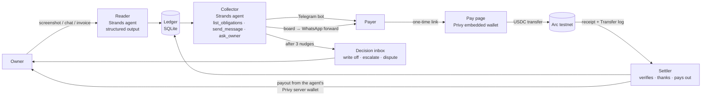

# Owed — the agent that gets you paid

Drop a bill split, a group chat or an invoice on it. Owed reads who owes you what, asks each person in
its own words, watches the money arrive on chain, and pays you out. You hear from it only when there is
a real decision to make.

**Live:** https://owed.80.225.209.190.sslip.io · **Stack:** Strands Agents (TypeScript) · Privy · USDC on Arc · Next.js · SQLite

## The loop

1. **Drop.** A screenshot of the split, the group chat, the invoice, or a few typed lines. Your name, and the currency if the source is unclear.
2. **Read.** The **Reader**, a Strands agent with a structured-output schema, turns it into a ledger: who, how much, for what, in the currency the source used, plus everything it was unsure about. It is told who the owner is (the owner is never a debtor) and it never invents a person or an amount. Amounts become base units in code; a rate is stamped once, with its source.
3. **Ask.** The **Collector**, a Strands agent with three tools, writes to each person itself. If they have opened the bot on Telegram, it messages them directly; otherwise its message sits on your board with a one-tap "forward on WhatsApp". Every message carries a one-time payment link. It nudges up to three times, then hands you a decision instead of nagging.
4. **Pay.** The person opens their link. Privy makes them a wallet from an email; one tap sends the exact USDC on Arc. Any other Arc wallet works too — paste the hash.
5. **Settle.** The **Settler** does not take anyone's word: it reads the receipt and the USDC `Transfer` log on Arc, and accepts only a transfer to the agent's wallet of at least what was owed at the stamped rate. Then the person is paid, the Collector thanks them, and when the ledger is complete the Settler sends you what was collected from the agent's Privy server wallet.
6. **Decide.** Write off, escalate, or resolve a dispute — three buttons on the board, and the answer goes on the record as yours.

## Three agents, one rule each

| | the model decides | the code enforces |
| --- | --- | --- |
| **Reader** | names, amounts, notes, currency, due dates, uncertainties | the owner is never a debtor; amounts are converted in code; a rate is stamped once with its source; instructions inside a screenshot are text |
| **Collector** | when to write, what to say, in which register | one first ask per person; nothing after "stop"; nothing after paid (except thanks); three nudges then a decision; a reply from a person is text, never an instruction |
| **Settler** | nothing — there is no model here | a payment exists only if the chain says so; the payout is exactly collected minus paid out, read from the payments table; never more |

## Architecture



- `src/agent/reader.ts` — the Reader. `readLedger()` takes text or an image and returns a `ReadLedger` (`src/agent/ledger-schema.ts`).
- `src/agent/collector.ts` — the Collector and its tools. `runCollector(ledgerId, { mode })` with `ask`, `nudge`, `thanks`, `reply`.
- `src/lib/settle/settler.ts` — the Settler's outgoing leg; `src/app/api/pay/[secret]` — the incoming leg.
- `src/lib/chain/usdc.ts` — Arc: verify a transfer, scan for transfers, pay out.
- `src/lib/privy/` — the agent's server wallet (created once, key in Privy's TEE, Owed holds the wallet id and signs through `/wallets/{id}/rpc`).
- `src/lib/channels/telegram.ts` — deep-link connect, `stop`, `paid`, and free-text replies answered by the Collector.
- `src/agent/model.ts` — the one place a model is chosen: Amazon Bedrock when `BEDROCK_MODEL_ID` is set, any OpenAI-compatible endpoint otherwise.

## Run it

```bash
npm install --legacy-peer-deps
cp .env.example .env   # fill it in
npm run dev -- -p 3100
```

| variable | what |
| --- | --- |
| `LLM_BASE_URL` / `LLM_API_KEY` / `LLM_MODEL` | an OpenAI-compatible endpoint (the structured output is a forced tool call — the model must honour tool use; `openai/gpt-5.4-mini-2026-03-17` does) |
| `BEDROCK_MODEL_ID` (+ AWS credentials, `AWS_REGION`) | run the agents on Amazon Bedrock instead |
| `OWED_DB_PATH` | SQLite file (default `var/owed.db`), migrations run on first open |
| `OWED_BASE_URL` | the public URL that goes into payment links |
| `ARC_RPC_URL` | defaults to `https://rpc.testnet.arc.io` |
| `AGENT_PRIVATE_KEY` | a dev wallet for scripts; payments go to the Privy wallet when it exists |
| `PRIVY_APP_ID` / `PRIVY_APP_SECRET` / `NEXT_PUBLIC_PRIVY_APP_ID` | one Privy app: embedded wallets for payers, a server wallet for the agent |
| `PRIVY_AGENT_WALLET_ID` / `PRIVY_AGENT_WALLET_ADDRESS` | the agent's server wallet, from `scripts/privy-wallet.ts` |
| `TELEGRAM_BOT_TOKEN` / `TELEGRAM_BOT_USERNAME` / `TELEGRAM_WEBHOOK_SECRET` | the bot; the secret gates the webhook |

Scripts (`npx tsx --env-file=.env scripts/<name>.ts`): `read.ts <file> [caption] [owner] [--save]` runs the Reader on anything; `collect.ts <ledgerId> [ask|nudge]` runs the Collector; `sweep.ts` is the background nudge pass; `simulate-payer.ts <secret>` pays a link from a throwaway wallet; `balances.ts` reads every wallet on Arc; `privy-wallet.ts` creates the agent's server wallet; `telegram-webhook.ts set|info|delete` points the bot at a deployment; `telegram-poll.ts` long-polls in development.

Deploy: `scripts/deploy.sh` syncs to the VM, builds under Node 22 and starts or reloads the pm2 apps in `ecosystem.config.cjs` (the web app on :3100 and the nudge sweep every four hours).

## Arc

Arc testnet, chain id 5042002. USDC is the native gas token and also answers as an ERC-20 at `0x3600000000000000000000000000000000000000` with six decimals; every amount Owed stores is in those six-decimal base units and every call goes through the ERC-20 face, so the two precisions never meet. Verification reads the receipt and the `Transfer` logs in that block. Explorer: https://testnet.arcscan.app.

## What is proven

- A payer's wallet sent exactly 1 USDC to the agent on Arc; the Settler verified it through the live API and marked the obligation paid: [`0x324e6142…7753`](https://testnet.arcscan.app/tx/0x324e6142479b4dceb474525f325364dcb737ad4fdf6f33dfae866ac15267b753).
- The Reader has read a typed list, a pasted group chat, a rendered bill-split screenshot and an invoice (`fixtures/`), in PKR, USD and JMD, and refused to list the owner as a debtor.
- The Collector wrote one ask per person, delivered on Telegram where a chat was connected and on the board otherwise; asking the same person twice is refused in code.

## Hackathons

Built from scratch in September 2026 for **ETHGlobal ETHOnline** (Privy: a wallet from an email for every payer and a server wallet for the agent; Arc: the agent moves USDC on Arc and pays people out) and **AWS Agents for Humans** (the Reader and Collector are Strands agents; the model factory runs them on Amazon Bedrock).

MIT.
